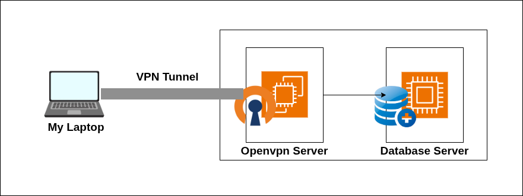
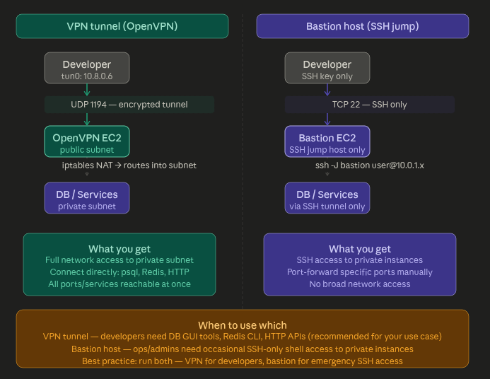
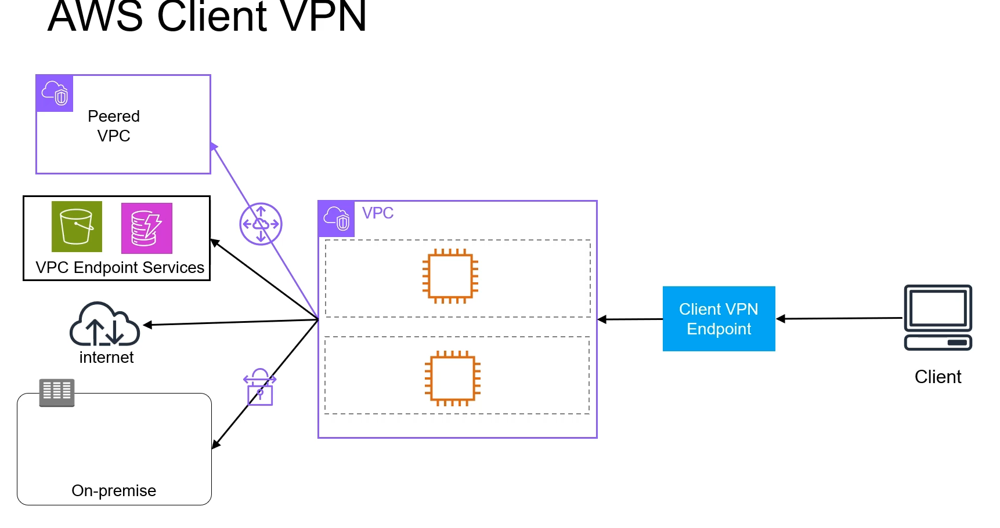

# VPN Tunnel to Private Resources

## Steps to create the VPN tunnel

1. Disable source/destination check on the EC2 instance that will act as the VPN server.

By default, AWS enforces a strict zero-trust networking rule: An EC2 instance must be the true origin (source) or the final target (destination) of any network traffic it sends or receives. When a packet arrives at or leaves the instance, AWS inspects the IP header. If the IP address does not exactly match the EC2 instance, AWS drops the packet immediately. This prevents a compromised instance from spoofing IPs or maliciously intercepting traffic meant for other servers.

2. In openvpn ec2 instance's security group, add an inbound rule to allow UDP traffic on port 1194 (the default OpenVPN port) and TCP traffic on port 22 (for SSH access).

3. In private ec2 instance's security group, add an inbound rule to allow traffic from the openvpn ec2 instance's security group on the necessary ports (e.g., HTTP, HTTPS, database ports).

4. Install and configure OpenVPN on the EC2 instance that will act as the VPN server.

5. Download the .ovpn client configuration file from the OpenVPN server and import it into your OpenVPN client software.

6. Connect to the VPN using the OpenVPN client. Once connected, you should be able to access the private EC2 instance as if you were on the same local network.

## VPN tunnel vs Bastion host

### VPN Tunnel

- Your laptop joins the private network as if it were physically inside AWS. Once connected, you can reach any private IP directly — open your DB GUI tool (TablePlus, DBeaver), hit an internal API with curl, connect to Redis with redis-cli — all without any extra tunnelling commands. Traffic is encrypted end-to-end via TLS.
  Connection command: just open your .ovpn file in the OpenVPN client app.

- If developers want to connect to database instances, they can do so directly from their local machines using their preferred database client tools. This eliminates the need for SSH tunnels or port forwarding, streamlining the workflow and improving productivity. Also the local applciations can connect to the private resources without any additional configuration, as if they were on the same local network.

### Bastion Host (SSH Jump)

You SSH into a hardened public EC2 instance, then jump from there into private instances. You don't get broad network access — only SSH shell sessions, or specific ports you manually forward.

---

## AWS Clint VPN Client

- AWS Client VPN is a fully managed VPN service that lets your team securely access resources inside a private AWS VPC without exposing them to the public internet.
- How it works — developers install the AWS VPN Client app, load a .ovpn config file, and connect. Once connected, their machine gets a private IP and can reach databases, internal APIs, and services in your private subnet directly — as if they were physically inside the network.

- Key advantages over self-managed OpenVPN:
  - No EC2 to maintain, patch, or monitor
  - Built-in high availability across availability zones
  - Scales automatically with your team size
  - Native CloudWatch logging for audit trails
  - Supports cert-based auth + Active Directory / SSO / SAML
